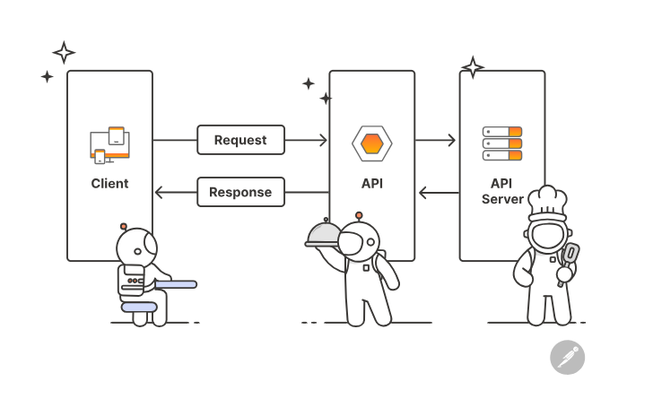

# 🌐 What is API?
**API** means **Application Programming Interface**.
👉 Simple meaning:  
An **API is a messenger** that helps two applications talk to each other.

---
## 🧠 Easy Example (Real Life)
Imagine you go to a restaurant:
- 🍽️ You = **Client (Mobile App)**
- 👨‍🍳 Kitchen = **Server (Backend)**
- 🧑‍💼 Waiter = **API**
You tell the **waiter** what you want.  
The waiter goes to the **kitchen** and brings your food.
👉 The waiter is like an **API**.  
It takes your request and brings back the response.

---
# 🌐 Types of API
There are **two main ways** to classify APIs:
1️⃣ Based on **Access (Who can use it)**  
2️⃣ Based on **Architecture (How it works)**

---
# 🟢 1️⃣ Based on Access Level

## 🔓 1. Public API
- Open for everyone
- Anyone can use it
**📌 Example:**
- Google Maps API
- Weather API
**Used for:**
- Weather apps
- Maps apps

---
## 🔐 2. Private API
- Used inside one company
- Not available to public
**📌 Example:**
- Company’s internal employee app API

---
## 🤝 3. Partner API
- Shared with specific partners
- Needs permission
**📌 Example:**
- Payment gateway APIs shared with trusted companies

---
# 🔵 2️⃣ Based on Architecture (Most Important for You 🔥)
## 1️⃣ REST API (Most Common 🚀)
- Uses HTTP methods (GET, POST, PUT, DELETE)
- Returns JSON
- Simple and widely used
**👉Used in Flutter with:**
- `http` package
- `dio` package
###### **👉 This is the most important for you as beginner**

---
## 2️⃣ SOAP API
- Older technology
- Uses XML
- More complex
**👉Used in banking systems sometimes**
###### **👉 Not common in Flutter projects today.**

---
## 3️⃣ GraphQL API
- Client requests exactly what data it needs
- More flexible
- Reduces extra data
**👉 Used by:**
- Facebook
- GitHub

---
## 4️⃣ WebSocket API
- Real-time communication
- Two-way connection
**👉 Used for:** **
- Chat apps
- Live games
- Live stock data
### **👉 Many other types Available provide in below Table**

---
# 📌📚Complete List of API Types (Based Architecture) 🔍

| API                                                                                         | Brief Description                                                                                                                                                  |
| ------------------------------------------------------------------------------------------- | ------------------------------------------------------------------------------------------------------------------------------------------------------------------ |
| [REST](https://tekblueprint.org/blog/arch/essentials-api/#rest)                             | An architectural style for building web services that uses standard HTTP methods (GET, POST, PUT, DELETE) and a resource-oriented approach.                        |
| [SOAP](https://tekblueprint.org/blog/arch/essentials-api/#soap)                             | A structured XML messaging protocol that supports strong schemas (WSDL) and advanced security features (WS-Security).                                              |
| [GraphQL](https://tekblueprint.org/blog/arch/essentials-api/#graphql)                       | An API query language that allows a client to request exactly the data they need and receive it in a single response.                                              |
| [gRPC](https://tekblueprint.org/blog/arch/essentials-api/#grpc)                             | A high-performance RPC framework from Google that uses Protocol Buffers and HTTP/2 for binary data exchange.                                                       |
| [MCP](https://tekblueprint.org/blog/arch/essentials-api/#mcp)                               | An open standard designed to unify interactions between artificial intelligence models (e.g., large language models, LLMs) and external tools, data, and services. |
| [WebSocket](https://tekblueprint.org/blog/arch/essentials-api/#websocket)                   | A two-way, full-duplex channel over a single TCP connection, allowing the server to initiate real-time data transfers.                                             |
| [JSON-RPC](https://tekblueprint.org/blog/arch/essentials-api/#jsonrpc)                      | A simple remote procedure call protocol that uses JSON to encode requests and responses.                                                                           |
| [OData](https://tekblueprint.org/blog/arch/essentials-api/#odata)                           | A REST-based data access protocol that enables querying, filtering, sorting, and pagination via URL parameters.                                                    |
| [SSE](https://tekblueprint.org/blog/arch/essentials-api/#sse)                               | Unidirectional data flow from server to client over a regular HTTP connection.                                                                                     |
| [Long Polling](https://tekblueprint.org/blog/arch/essentials-api/#long-polling)             | A technique for simulating a push connection: the client sends a request, the server holds it until new data becomes available, then responds.                     |
| [STOMP](https://tekblueprint.org/blog/arch/essentials-api/#stomp)                           | A simple text-based protocol for exchanging messages over brokers (e.g., WebSocket).                                                                               |
| [Webhooks](https://tekblueprint.org/blog/arch/essentials-api/#webhooks)                     | HTTP callbacks automatically sent by the server when a specific event occurs.                                                                                      |
| [MQTT](https://tekblueprint.org/blog/arch/essentials-api/#mqtt)                             | A lightweight publish/subscribe protocol for transmitting telemetry and IoT device data in small packets.                                                          |
| [AMQP](https://tekblueprint.org/blog/arch/essentials-api/#amqp)                             | A messaging protocol with guaranteed delivery, supporting queuing, routing, and transactions.                                                                      |
| [EDI](https://tekblueprint.org/blog/arch/essentials-api/#edi)                               | Electronic Data Interchange, a standardized format for transferring business documents between companies.                                                          |
| [CoAP](https://tekblueprint.org/blog/arch/essentials-api/#coap)                             | A protocol for resource-constrained devices that operates over UDP and supports REST-like requests.                                                                |
| [WebRTC DataChannel](https://tekblueprint.org/blog/arch/essentials-api/#webrtc-datachannel) | A peer-to-peer data channel for transferring arbitrary data (not just audio/video) between browsers using DTLS/SCTP.                                               |

---
# 🚀 Complete List of API Types (Simple & Professional)
| No.   | API                | Easy Explanation                                                                    | (For You?)                 |
| :---- | :----------------- | :---------------------------------------------------------------------------------- | :------------------------- |
| ==1== | ==REST==           | ==Most common API. Uses GET, POST. Returns JSON. Used in almost every mobile app.== | ==✅ **Yes – Must Learn**== |
| 2     | SOAP               | Old XML-based API. Mostly used in banking & enterprise systems.                     | ❌ Not needed now           |
| 3     | GraphQL            | Client asks only the data it needs. More flexible than REST.                        | ✅ Learn After REST         |
| 4     | gRPC               | Very fast API from Google. Uses binary data.                                        | ⚡ Advanced (Later)         |
| 5     | MCP                | Used for AI models to connect with tools and services.                              | ❌ Not needed now           |
| 6     | WebSocket          | Real-time connection. Used in chat apps, live updates.                              | ✅ Good to Learn            |
| 7     | JSON-RPC           | Simple remote call using JSON format.                                               | ❌ Rare in mobile apps      |
| 8     | OData              | REST-based protocol with filtering & sorting via URL.                               | ❌ Enterprise level         |
| 9     | SSE                | Server sends live updates one way only.                                             | ❌ Optional                 |
| 10    | Long Polling       | Old technique for real-time updates.                                                | ❌ Not important now        |
| 11    | STOMP              | Messaging protocol over WebSocket.                                                  | ❌ Advanced messaging       |
| 12    | Webhooks           | Server automatically sends data when event happens.                                 | ✅ Good to Know             |
| 13    | MQTT               | Lightweight protocol for IoT devices.                                               | ❌ IoT field                |
| 14    | AMQP               | Advanced messaging protocol with queue system.                                      | ❌ Enterprise messaging     |
| 15    | EDI                | Business document exchange between companies.                                       | ❌ Corporate systems        |
| 16    | CoAP               | Used for small IoT devices.                                                         | ❌ IoT field                |
| 17    | WebRTC DataChannel | Browser-to-browser direct data transfer.                                            | ❌ Web/Video apps           |

---
# 🎯🌐 What YOU Should Focus On (Very Important)
Since you are:
- Beginner Flutter Developer
- Beginner Tester
- Intern
#### 🚀 **You should focus only on**
### 🥇 1. REST API (Most Important)
### 🥈 2. WebSocket (For chat / live apps)
### 🥉 3. GraphQL (After REST)
### ⭐ 4. Webhooks (Basic idea)

### **👉  That’s enough for beginner → intermediate level 🚀**

---
# 🎯🎯🌐 REST FULL APIs 🌐🎯🎯
- **👉 RESTful API ek architectural style hai jo HTTP methods ka use karke client aur server ke darmiyan data exchange karta hai.**
- **👉 REST Full API ka full form hai Representational State Transfer API**.
- **👉 A RESTful API is an architectural style that uses HTTP methods to enable communication and data exchange between a client and a server.
- **👉 A RESTful API allows a client and server to communicate using HTTP methods like GET, POST, PUT, and DELETE.
## 🏗 RESTful API ki khas baatein
- ✅ HTTP methods use karta hai (GET, POST, PUT, DELETE)
- ✅ Mostly JSON format me data deta hai
- ✅ Simple aur lightweight hota hai
- ✅ Mobile apps (Flutter), Web apps me zyada use hota hai
## 🧠 REST ka basic concept
